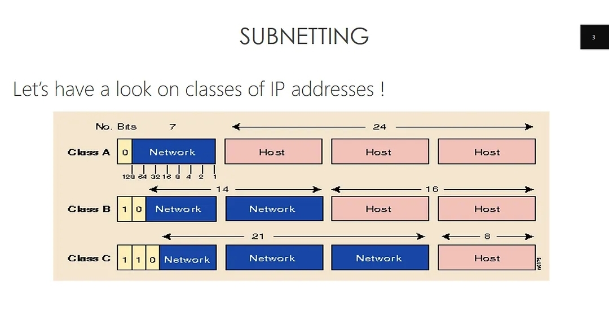
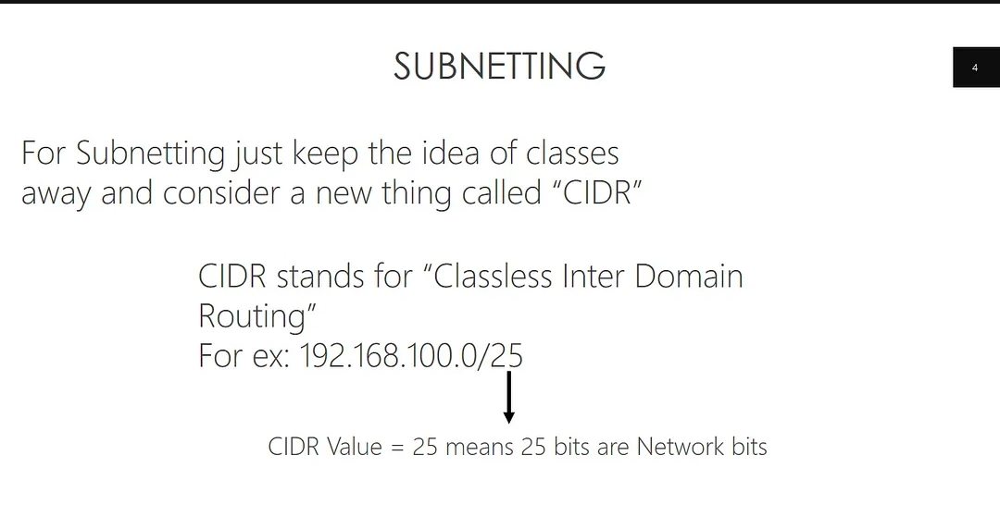
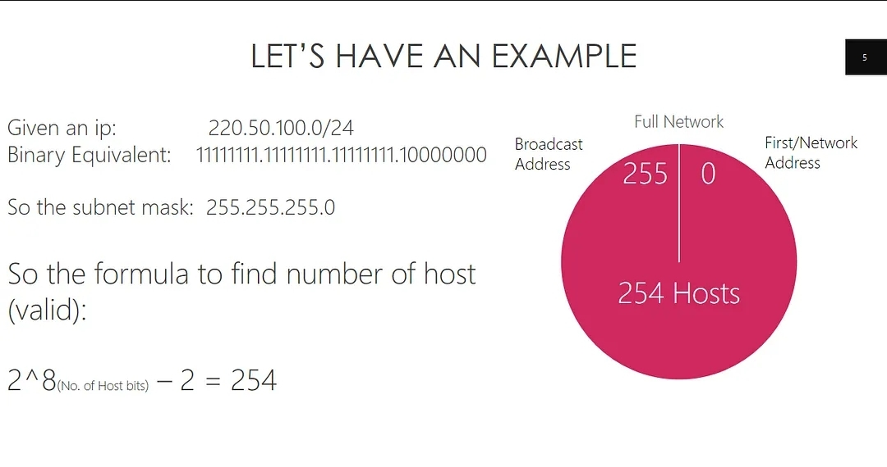
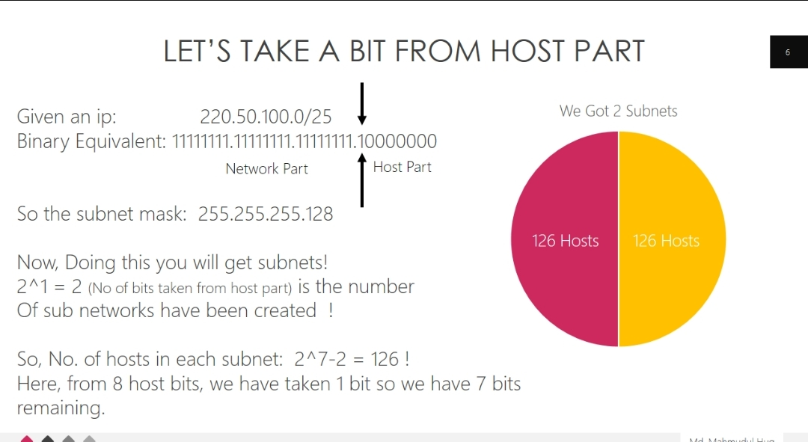
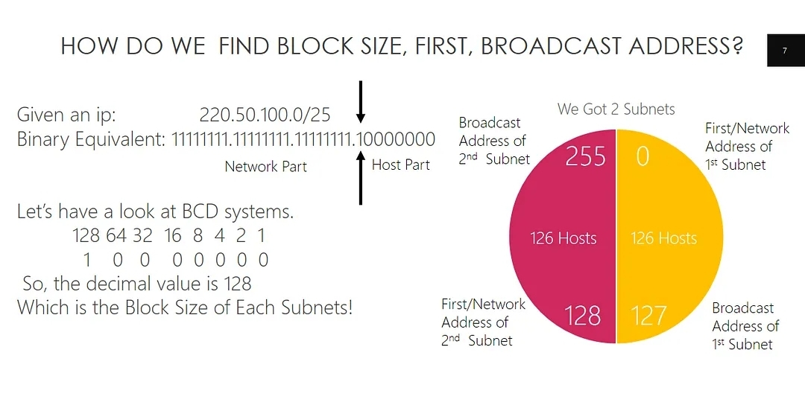
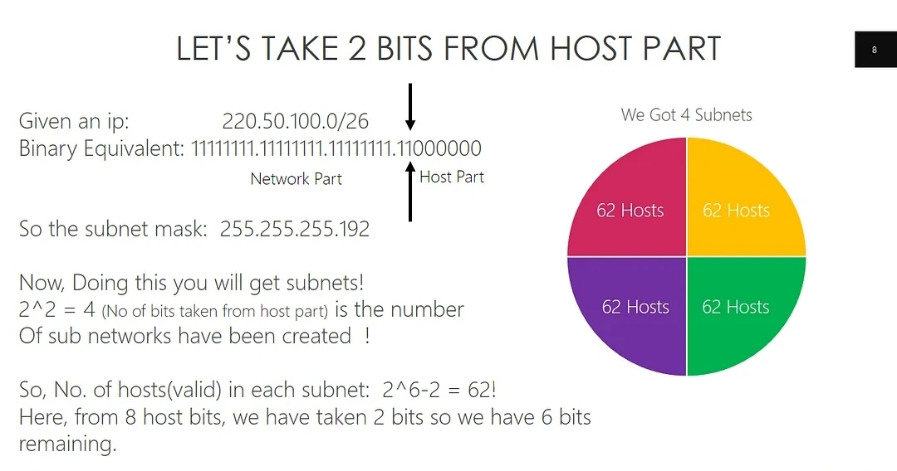
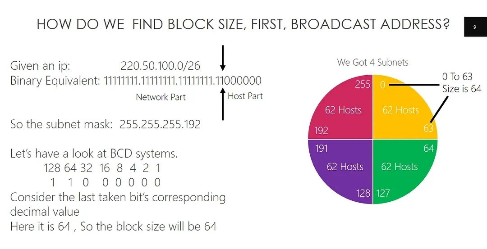
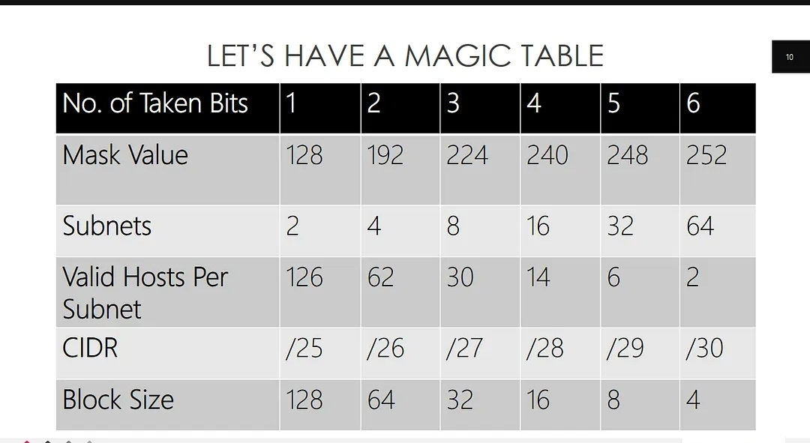

# Day 1: IP address and Subnetting

IP address:

আমরা যারা ইন্টারনেট ব্যবহার করি মোটামোটি সবাই IP (Internet Protocol) Address দেখেছি, কিন্তু এটা সম্পর্কে হয়তো এখনো অনেকেই জানিনা। যেমন, IP কি? আইপি এড্রেস কি? আমরা কেন IP Address ব্যবহার করি? চলুন জেনে নিই ইপি এড্রেস সম্পর্কে।

## **IP (Internet Protocol) কি?**

IP হচ্ছে Internet Protocol এর সংক্ষিপ্ত রূপ।

## **IP Address কি/আইপি অ্যাড্রেস কী? IP address কাকে বলে?**

IP Address হলো Internet Protocol Address। ইন্টারনেটের সাথে সংযুক্ত প্রতিটি কম্পিউটারের একটি ঠিকানা থাকে এ ঠিকানাকে বলা হয় আইপি অ্যাড্রেস (IP Address)।

## **আইপি এড্রেস দিয়ে কি করা যায়?**

তথ্য আদান প্রদানে সাধারানত IP Address ব্যবহৃত হয়ে থাকে। আইপি অ্যাড্রেসের সাহায্যে নেটওয়ার্কভুক্ত লক্ষ লক্ষ কম্পিউটার পৃথকভাবে সনাক্ত করা সম্ভব হয়। সাধারণ ব্যবহারকারীগণ ইপি এড্রেস এর মাধ্যমে তথ্যবলি গ্রহণ ও প্রেরণ করে থাকেন। আইপি অ্যাড্রেসকে বিভিন্ন ক্যারেক্টারের সাহায্যে চিহ্নিত করা যায়। ক্যারেক্টার ফর্মে আইপি অ্যাড্রেসের নামকে ডোমেইন নেম বলে।

## **আমরা কেন IP (Internet Protocol) ব্যবহার করি?**

ইন্টারনেট প্রটোকল হল একটি সাংখ্যিক লেবেল যা একটি কম্পিউটার নেটওয়ার্ক থেকে সংযুক্ত প্রতিটি ডিভাইসের জন্য নির্ধারিত হয়। Network এর মাধ্যমে যোগাযোগ করার জন্য Internet Protocol (IP) Address ব্যবহৃত হয়। আরো সংক্ষেপে বলা যায় একটি IP Address হল একটি Network এর Node বা Host সংযোগ এর Logical Identifier. IP network এ প্রতিটি Host কে একটি নির্দিষ্ট নাম্বার দিয়ে নির্দেশ করা হয় আর এই নাম্বারই হচ্ছে IP (Internet Protocol). IP 32 Bit এর হয়ে থাকে, যাকে ৮ Bit করে ৪ ভাগে ভাগ করা হয়।

## **Class or Type of IP**

**৫ টি ক্লাস নিয়ে IP গঠিত। ক্লাস গুলো হচ্ছেঃ**

1. Class A
2. Class B
3. Class C
4. Class D
5. Class E

আমরা এবার জানবো কিভাবে IP এর ক্লাস গুলো কাজ করে।

# **Class A**

Class A এর IP শুরু হয় 0 থেকে, শেষ হয় 127 এ গিয়ে ।

যেসব IP Address এর প্রথম Bit বাইনারি 0 থেকে শুরু হয় সেগুলো হচ্ছে Class A এর IP. এ ধরনের IP এর ক্ষেত্রে প্রথম 8 Bit নেটওয়ার্ক Bit আর বাকি 24 Bit হচ্ছে Host.

নেটওয়ার্ক Bit যদি Host Bit এর তুলনায় কম হয় তাহলে ধরে নিতে হবে এটা Class A এর IP Address.

উদাহরণঃ 10.0.0.1 থেকে 126.255.255.254

# **Class B**

# 

Class B এর IP শুরু হয় 128 থেকে আর শেষ হয় 191 এ গিয়ে।

এই IP Address এর প্রথম ২ টি Bit এর মান হবে 10. এ ধরনের IP এর ক্ষেত্রে প্রথম 16 Bit হবে নেটওয়ার্ক Bit আর বাকি 16 Bit হবে Host Bit.

যদি নেটওয়ার্ক Bit এর সংখ্যা প্রায় Host এর সমপরিমাণ হয় তাহলে ধরতে হবে এটি Class B এর IP Address.

উদাহরণঃ 128.1.0.1 থেকে 191.255.255.254

# **Class C**

# 

Class C এর IP শুরু হয় 192 থেকে আর শেষ হয় 223 এ গিয়ে।

এই IP Address এর প্রথম ৩ টি Bit এর মান হবে 110. এই ধরনের IP এর ক্ষেত্রে 24 Bit Network আর 8 Bit Host.

যদি নেটওয়ার্ক Bit এর সংখ্যা Host এর তুলনায় বেশি হয় তাহলে Class C এর IP Address সিলেক্ট করতে হবে।

উদাহরণঃ 192.0.1.1 থেকে  223.255.254.254

# **Class D**

এটি বিশেষ ধরনের IP Class  যাকে Multicast Network বলা হয়। কোন Host Network এর সকল Router কে খুঁজে বের করার জন্য এই ধরনের IP ব্যবহার করা হয় ।

এই Class এর IP 224 থেকে 239 পর্যন্ত হয়ে থাকে।

উদাহরণঃ 224.0.0.0 থেকে  239.255.255.255

# **Class E**

Class E এর IP গুলো সাধারনত গবেষণার ক্ষেত্রে ব্যবহার করা হয়, Class E তে IP 240 থেকে শুরু হয়ে 255 তে গিয়ে শেষ হয়।

উদাহরণঃ 240.0.0.0 থেকে 254.255.255.254

## **IP Address-এর ভার্সন**

আইপি অ্যাড্রেসের দুইটি ভার্সন IPV4 ও IPV6 চালু আছে।

# **IPv4:**

IPv4 হচ্ছে Internet Protocol Version 4 এর সংক্ষিপ্ত রূপ। এটি হচ্ছে Internet Protocol এর ৪র্থ সংস্করণ এবং Standard Internetworking পদ্ধতির মূল প্রোটকল।

১৯৮৩ সালে IPv4 এর প্রথম সংস্করনের জন্য ARPANET(Advanced Research Projects Agency Network ) কর্তৃক এটি তৈরি করা হয়। IPv4 হল ৩২ বিট এর অ্যাড্রেস স্পেস যার মাধ্যমে প্রায় ৫ বিলিয়ন অ্যাড্রেস ব্যবহার করা সম্ভব। তথ্য প্রযুক্তির এ যুগে খুব অল্প সময়ের পরিবর্তনে অসংখ্য নেটওয়ার্ক ডিভাইস যুক্ত হচ্ছে ইন্টারনেট এর সাথে  আর প্রত্যেকটি ডিভাইস এর জন্য একটি করে IP Address ব্যবহার হয়। নেটওয়ার্ক গবেষক দের মতে IPv4 প্রায় বিলুপ্ত হওয়ার পথে। Internet Assigned Numbers Authority (IANA) একটি নতুন সংস্করণ তৈরি করেন যার নামকরন করা হয় IPv6 (Internet Protocol Version 6). আমরা বর্তমানে আমাদের মোবাইল কম্পিউটার এ যে নেটওয়ার্ক ব্যবহার করছি সেগুলো ও IPv4 এর নেটওয়ার্ক।

# **IPv6:**

IPv6 হল ১২৮ বিট এর একটি স্পেস যা প্রায় 340 Undecillion (Undecillion মানে ৩৪০ এর পর আরো ৩৬ টি ০) অ্যাড্রেস প্রধান করে। এরই মধ্যে দিয়ে অনেক জায়গায় IPv6 এর ব্যবহার শুরু হয়ে গেছে। IPv4 থেকে IPv6 এ রুপান্তরের ফলে ইন্টারনেট এ উভয় Protocol ব্যবহার হচ্ছে। আর এই প্রক্রিয়াটি সহজ করার জন্য Internet Engineering Task Force (IETF) কয়েকটি সিস্টেম তৈরি করেছে।

সিস্টেম গুলো হচ্ছেঃ

- Dual Stack
- Tunneling
- Translation

# **Dual Stack**

Dual Stack হচ্ছে এমন একটি পদ্ধতি যার মাধ্যমে কোন একটি নেটওয়ার্কে একই সাথে IPv4 ও IPv6 Protocol ব্যবহার করা যায়।

# **Tunneling**

Tunneling হচ্ছে এমন একটি পদ্ধতি যেখানে IPv4 নেটওয়ার্ক এর মধ্য দিয়ে IPv6 এর প্যাকেট সমূহ চলাচল করতে পারে।

# **Translation**

এই পদ্ধতিতে একটি IPv4 ও IPv6 Protocol যুক্ত ডিভাইস এর মধ্যে যোগাযোগের জন্য NAT64 নামক একটি Translation পদ্ধতি ব্যবহার করা হয়।  NAT64 এ  IPv4 এ্যাড্রেস থেকে IPv6 এ্যাড্রেসে এবং একটি IPv6 এ্যাড্রেস থেকে IPv4 এ্যাড্রেসে প্যাকেটসমূহকে ট্রান্সলেট করা হয়।

## **ip address কিভাবে বের করবো?**

IP address বের করা অনেক সহজ। ইপি এড্রেস বের কয়ার জন্য দুইটি উপায় রয়েছে। উপায় দুইটি হলোঃ

- Internet Search
- Windows Command Prompt

কিভাবে একটি আইপি অ্যাড্রেস খুজে বের করা যায় এই বিষয়গুলো সম্পর্কে নিচে বিস্তারিত আলোচনা করা হল।

# **Internet Search এর মাধ্যমে আইপি এড্রেস বের করার নিয়ম**

Computer বা Mobile থেকে IP address জানার জন্য যেকোনো একটি ব্রউজার ওপেন করুন। এবার গুগলে গিয়ে [whatisIPaddress.com](https://whatismyipaddress.com/) লিখে সার্চ করুন।

আপনাকে একটি ওয়েবসাইটে নিয়ে যাওয়া হবে এবং সেখানে আপনাকে আইপি এড্রেসের সম্পর্কে বিস্তরিত তথ্য দিয়ে দিবে। যেমন-

- আপনার IP address দেখিয়ে দিবে।
- **IPS –** কোন কোম্পনির ইন্টারনেট ব্যবহার করছেন।
- **Region –** কোন জায়গায় আপনার ডিভাইসটি রয়েছে।
- **Country –** আইপি এড্রেসটি কোন দেশে রয়েছে।

# **Windows Command Prompt এর মাধ্যমে IP address বের করার নিয়ম**

- **Step-1:** Windows Command Prompt এর মাধ্যমে আইপি এড্রেস বের করার জন্য কম্পিউটার থেকে **windows logo** এর সামনে থাকা **search box** এ **CMD** টাইপ করে সার্চ করুন।
- **Step-2:** এবার আপনি command prompt এ একটি আইকন (icon) দেখতে পাবেন। সেই icon এ গিয়ে mouse এ right click করে **run as administrator** অপশনে ক্লিক করুন।
- **Step-3:** এবার আপনার কম্পিউটারে command prompt চালু হয়ে যাবে এবং কম্পিউটার কীবোর্ড থেকে টাইপ করুন **IPconfig** এবং **Enter** চাপুন। তাহালে, কম্পিউটারের IPV4 এবং IPV6 এড্রেস গুলো দেখতে পাবেন।

**Subnetting**:

শুরুতে একটু ক্ষুদা নিবারণ করা যাক। বন্ধুরা মিলে পিজ্জা খেতে গেলাম। অর্ডার করার মাত্রই এসে পড়ল পিজ্জা । তবে রেস্ট্রুরেন্ট কর্তৃপক্ষ ভুলে স্লাইস করতে ভুলে গেলেন। তখন তাদের আবার ডাকা হলো সবাইকে একটা টুকরো করে ভাগ করে দিতে।

একই ভাবে একটা নেটওয়ার্ককে যখন আমরা কয়েকটা টুকরো করি (সাবনেট) করি তখন এই প্রক্রিয়াকে আমরা নেটওয়ার্কিং ভাষায় বলি “সাবনেটিং”

কি লাভ এটা করে? দেখুন বিশাল বড় নেটওয়ার্ক ম্যানেজ করা কঠিন, আর একটা অফিসে বিভিন্ন ডিপার্টমেন্টে রিকোয়েরমেন্ট ভিন্ন হতে পারে। তাই আলাদা আলাদা করে সাবনেট তাদের দিলে ম্যানেজ করাও সহজ হবে আর কোন সমস্যা হলে খুঁজে বের করাও সহজ হবে। এখন আসি কীভাবে করা যায়।

এর আগে একটু ক্লাস নিয়ে অল্প আইডিয়া নেই। (এটার পূর্নাঙ্গ পর্ব আসবে)। আইপি এড্রেস ভার্সন ৪ এ মোট ৩২ বিটের এড্রেস থাকে। এখন এই ৩২ কে ৪ টা অকটেটে ভাগ করা হয়। প্রত্যেকটা অকটেট ৮ বিটের হয়ে থাকে। 

এখন এই বিটগুলো দুইভাগে বিভক্ত থাকে একটা হচ্ছে “নেটওয়ার্ক” পার্ট আরেকটি হচ্ছে “হোষ্ট ” পার্ট।

কয়টা বিট নেটওয়ার্ক পার্টে যাবে আর কয়টা বিট হোষ্ট পার্টে যাবে এটার উপর ডিপেন্ড করে কতগুলো ক্লাসে ভাগ করা হয়েছে । 

ক্লাস এ তে প্রথম ৮ বিট নেটওয়ার্ক পার্ট আর বাকী ২৪ বিট হোষ্ট পার্ট। তেমনি ক্লাস বি , সি ,ডি, ই এই ৫ টি ক্লাসে ভাগ করা হয়।

এইযে নেটওয়ার্ক পার্ট এটা দ্বারা আমরা বুঝি আইপি এড্রেসটি কোন নেটওয়ার্কের অংশ। এটা ফিক্স থাকে। আর হোষ্ট পার্ট বিভিন্ন কম্বিনেশন হয়ে থাকে। এটা নিয়ে লিখলে অনেক বড় হবে। ধরে নেই আপাতত এই ক্লাস নামক কিছু আছে। 

নিচের ছবিতে এটা ইলাস্ট্রেট করা হয়েছে। কোন এড্রেস কোন ক্লাসের সেটা অন্য পর্বে আলোচনা হবে ।

আরেকটা পদ্ধতি আছে যেখানে এই ক্লাস নিয়ে চিন্তাই করা হয়না। সেটাকে ক্লাসলেস আইপি বলে ! এখন ক্লাসলেসে কোন ফিক্স নেটওয়ার্ক পার্ট নেই তার মানে ফ্লেক্সিবিলিটি বেশি কেননা যখন কোন কিছু ফিক্সড থাকে আমাদের একচুয়াল রিকোয়েরমেন্ট এর সাথে সেটা অনেক ক্ষেত্রেই নাও মিলতে পারে।

তো ক্লাসবিহীন এই পদ্ধতির নাম “CIDR” অর্থাৎ Classless Inter Domain Routing
Example: 192.168.100.0/25 এই স্ল্যাশ ২৫ দিয়ে বুঝায় ২৫ তি বিট ৩২ বিটের মধ্যে নেটওয়ার্ক পার্টে ব্যবহার হয়ে গেছে।

Example:

উপরের এই এক্সাম্পলে একটা আইপি এড্রেস দেয়া 220.50.100.0/24 তো ২৪/৮ = ৩ অর্থাৎ ৩ টি অকটেট নেটওয়ার্ক পার্টে ব্যবহার করা হয়েছে। তাহলে হোষ্ট পার্টে আছে ৩২-২৪ = ৮ বিট। এক্ষেত্রে শেষ ৮ বিট। নেটোয়ার্ক পার্ট বুঝাতে 1 আর হোষ্ট পার্ট বুঝাতে 0 ব্যবহার করা হয়। যেহেতু প্রত্যেক অকটেট ৮ বিট আর বিট মানে ০/১ তাহলে যতগুলো বিট নেটওয়ার্ক পার্টে ততগুলা ১ হবে আর হোষ্ট পার্টে যারা আছে ততগুলা ০ হবে ।

সাবনেট মাস্ক তাহলে ২৫৫.২৫৫.২৫৫.০ দিয়ে কি বুঝায়? ওইযে বললাম ০ আর ১ এর হিসাব। বিসিডি কনভার্ট করলে ১১১১১১১১ দ্বারা ২৫৫ বুঝায়।
এখন যেকোন আইপি এড্রেসে সব হোষ্ট দিয়ে আমরা কম্বিনেশন বানাতে পারব না। প্রথম অর্থার ০ দিয়ে নেটওয়ার্ক এড্রেস বুঝায় অর্থাৎ এটি কোন নেটওয়ার্কের অংশ/ আর শেষ ২৫৫ দিয়ে এটা ব্রডকাস্টের জন্য প্রিসার্ভ থাকে।
তাহলে এই দুইটা বাদে কয়টা কম্বিনেশন/সমাবেশ সম্ভব?
2⁸ -2 = 256–2 = 254 ! তাহলে আমরা ২৫৪ টা আইপি এড্রেস এই সাবনেট থেকে পাবো। মজার ব্যাপার ২৫৪ টা ডিভাইসে এই আইপি আমরা চাইলে দিতে পারব স্পেসিফিক ভাবে।

এই এক্সাম্পলটা একটু ভিন্নভাবে দেখি। 220.50.100.0/25 দেয়া আছে।

কি বুঝায় এটি দিয়ে? এখনে ২৫ টি বিট নেটওয়ার্ক পার্টে ব্যবহার হয়েছে। এখন ২৫ তম বিট আগের নেটওয়ার্কের বেলায় ০ ছিল এখন সেটা ১ । এর মানে আগের সেই নেটওয়ার্ককে পিজ্জার মতো ভাগ করা হল কিন্তু কয়টা ভাগে?
সহজ উত্তর হোস্ট পার্টে যতগুলা শুন্যকে ১ বানাও হয়েছে সেটাকে ২ এর পাওয়ার করলে যা হয়। এক্ষেত্রে 2¹ = 2 টি সাব নেটওয়ার্কে ভাগ করা হয়েছে।
এইবার সাবনেট মাস্ক আগেরটা মতো থাকবেনা কেননা শেষ অকটেটে এখন আগের মতো ০০০০০০০০ এর যায়গায় ১০০০০০০০ হয়ে গেছে যেটার ডেসিমাল কনভার্ট করলে ভ্যালু দ্বাড়ায় ১২৮।
তাহলে প্রত্যেকটা সাবনেটে কতগুলো আইপি দেয়া সম্ভব মানে কম্বিনেশন ? মনে রাখা দরকার যতুই ভাগ করিনা কেন ২ টি এড্রেস কিন্তু ব্যবহার করা যাবেনা। শুরু এবং শেষ ।

তাহলে এইবার হোষ্ট পার্টে শূন্য আছে ৭ টি ! তাহলে কম্বিনেশনের সূত্র মতে
আমরা হোষ্ট পাবোঃ 2⁷ -2 = 126 !

এইবার ভাগাভাগি শেষ, চলুন বের করি কিছু তথ্য

এই ক্ষেত্রে ৪র্থ অকটেটে ১০০০০০০০ কে ডেসিমালে কনভার্ট করলে দ্বাড়ায় ১২৮ তাহলে প্রত্যকে সাবনেটে ব্লক সাইজ ১২৮ যার মধ্যে ১২৬ টি ব্যবহার যোগ্য।
১ ম সাবনেট তাহলে শুরু হবে ০ থেকে ১২৭ পর্যন্ত যেখানে ১ থেকে ১২৬ পর্যন্ত ভ্যালিড হোষ্ট অর্থাৎ ১২৬ টি।

২য় সাবনেট তাহলে শুরু হবে ১২৮ থেকে ২৫৫ পর্যন্ত যেখানে ভ্যালিড হোষ্ট হবে ১২৯ থেকে ২৫৪ পর্যন্ত অর্থাৎ ১২৬ টি।

এখন আরেকতি বিট হোষ্ট পার্ট থেকে নিয়ে নেই । এইবার তাহলে কয়টা ১ আর কয়টা শুন্য থাকল ?
উত্তরঃ ২ টি ১ আর ৬ তি শূন্য।
এইবার তাহলে সাবনেট মাস্ক কি হবে ? ২৫৫.২৫৫.২৫৫.?

উত্তরঃ ১১০০০০০০ কে কনভার্ট করলে ডেসিমালে ১৯২ । এইযে দুটো বিট নিয়ে নিলাম তাহলে এইবার কয়টা টুকরো হলো নেটওয়ার্কে ?

2² = 4 বাহ চার টি সাবনেটোয়ার্কে ভাগ হয়ে গেল ! তাহলে এইবার প্রত্যেক সাবনেটে ভ্যালিড হোষ্ট কয়টি ? 2⁶ -2 = 6২ টি ! 

ধরুন এই চারটি সাবনেটকে আমরা ৪ টি ডিপার্টমেন্টে দিলাম, সিএসই, ইইই, বিবিএ, ফার্মাসি। তাহলে প্রত্যেক ডিপার্ট্মেন্ট ৬২ টি করে সর্বোচ্চ আইপি এড্রেস পাবে ।

তাহলে ব্লক সাইজ, ফার্স্ট ,ব্রডকাস্ট এড্রেসও বের করা সহজ হয়ে গেল।
০ থেকে ৬৩ পর্যন্ত মোট ৬৪ টি এড্রেস দেয়া হলো সিএসই কে।
৬৪ থেকে ১২৭ পর্যন্ত দেয়া হলো ইইই কে। সিমিলার্লি ছবিতে পরিষ্কার ভাবে দেয়া আছে।

একটা যাদু দেখাই চলুন। নিচের টেবিলে আছে যাদু !

নেটওয়ার্ক পার্ট থেকে ১ টি করে বিট নিতে থাকি। যখন ১ বিট নেই মাস্ক ভ্যালু দ্বাড়ায় ১২৮ (১০০০০০০০ এর ডেসিমাল)
সাবনেট দ্বাড়ায় ২ টি । ভ্যালিড হোষ্ট ১২৬ টি । CIDR ভ্যালু স্ল্যাশের ভ্যালু ২৪+১ = ২৫ । ব্লক সাইজ ১২৮।

সিমিলার্লি ২ বিট নিলে মাস্ক দ্বাড়ায় ১৯২ (১১০০০০০০ এর ডেসিমাল)। সাবনেট হয় ৪ টা। মজার ব্যাপার বাম থেক ডানে গেলে সাবনেটের ব্যালায় কেবল দিগুন হচ্ছে।

ভ্যালিড হোষ্টের বেলায় বাম থেকে ডানে গেলে দুই দিয়ে ভাগ করে ১ বিয়োগ করলেই হচ্ছে! ১২৬/২ = ৬৩ থেকে ১ বিয়োগ করলে হয় ৬২ ! সিমিলার্লি (৬২/২-১) = ৩১-১ = ৩০ ! মজা না? পুরাই পর্যায় সারণী টাইপ একটা ফিল আসছে।

CIDR তো সহজ ২৪ এর সাথে যতগুলা বিট নেয়া হলো সেটা যোগ করলেই হলো।
আর ব্লক সাইজ তো আরো জোস ! বাম থেকে ডানের নিয়মটা হলো দুই দিয়ে ভাগ করতে থাকুন ।
এখন মনে রাখা দরকার এটা কিন্তু আমাদের বেস নেটওয়ার্ক এর জন্য প্রযোজ্য যেখানে শুরুতে যখন ভাগ হয়নি তখন ২৪ বিট অলরেডি নেটওয়ার্ক পার্টে চলে গিয়েছিল। এরপর আমরা ১ বিট ২ বিট করে নিয়ে সাবনেট করা শুরু করি।

তবে জনগনের একটাই প্রশ্ন ৬ টা পর্যন্তই কেন বিট নিলাম ? ৭ কিংবা ৮ কেননা?

আচ্ছা সাবনেটের ফর্মুলা কি ছিল ? হোষ্ট পার্টে কয়টা এক আছে সেটা ২ এর পাওয়ার করলে যা হয় ততগুলা ভাগ করা যাবে?

আচ্ছা ৭ তি বিট নিলে, হোষ্ট পার্ট থাকে মাত্র ১টা শুন্য ! এখন ভ্যালিড হোষ্টের সুত্র মতে 2¹ -2= 0 ! এইখানেই সমস্যা ! কোন ভ্যালিড হোষ্টই পাওয়া গেলনা ! তাহলে আইপি এড্রেসই যখন নেই তাহলে নেটওয়ার্ক পার্টে ৭ বিট নিয়ে গেল কি লাভ?

আর ৮ বিট নিলে তো কিছুই থাকল না! কম্বিনেশন হয় কতগুলা শূন্য আছে তার উপর আর ১ কতগুলা সেটার উপর ডিপেন্ড করে কতগুলা সাবনেটওয়ার্ক বানানো সম্ভব।